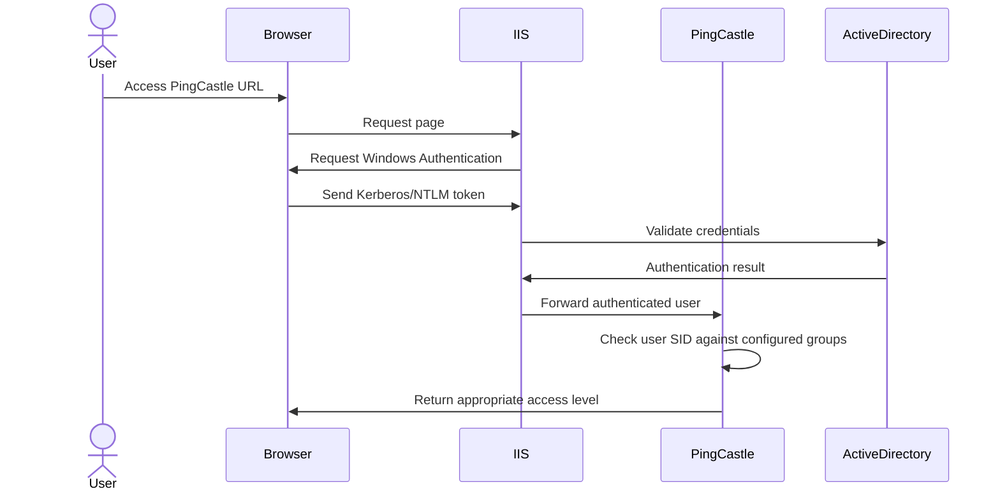

import PingCastleEditionTabs from '@site/src/components/PingCastleEditionTabs';
import TabItem from '@theme/TabItem';

# Configuring Authentication Providers

<PingCastleEditionTabs>

<TabItem value="basic">

The Basic edition uses command-line only access with pingcastle.exe and does not support web-based authentication providers.

</TabItem>

<TabItem value="pro">

PingCastle Professional can use various authentication providers for web UI access. Authentication Providers are configured in the appsettings.json file. The Professional edition supports up to 5 domains with simplified user access.

</TabItem>

<TabItem value="enterprise">

PingCastle Enterprise can use basically any authentication provider needed for web UI access. Authentication Providers are configured in the appsettings.json file. The Enterprise edition supports unlimited domains with full role-based access control.

</TabItem>

</PingCastleEditionTabs>

# Windows Authentication Provider

<PingCastleEditionTabs>

<TabItem value="basic">

Windows Authentication is not applicable to the Basic edition as it only supports command-line access.

</TabItem>

<TabItem value="pro">

Windows Authentication allows users to access PingCastle Professional using their domain credentials for up to 5 domains.

</TabItem>

<TabItem value="enterprise">

Windows Authentication allows users to access PingCastle Enterprise using their domain credentials with unlimited domain support and role-based access control.

</TabItem>

</PingCastleEditionTabs>

## Authentication Flow



## Prerequisites

### Enable Windows Authentication Feature

**GUI Method:**

1. Open Server Manager
2. Click on "Add roles and features"
3. Navigate to "Web Server (IIS)" > "Web Server" > "Security"
4. Check "Windows Authentication"
5. Click Next and then Install

**PowerShell Method:**

```powershell
Install-WindowsFeature -Name Web-Windows-Auth
```

### Enable Windows Authentication in IIS for PingCastleEnterprise Website

**GUI Method:**

1. Open Internet Information Services (IIS) Manager
2. Navigate to the PingCastleEnterprise website
3. Double-click on "Authentication"
4. Right-click on "Windows Authentication" and select "Enable"
5. Right-click on "Anonymous Authentication" and select "Disable"

**PowerShell Method:**

```powershell
# Enable Windows Authentication
Set-WebConfigurationProperty -Filter "/system.webServer/security/authentication/windowsAuthentication" -Name "enabled" -Value "True" -PSPath "IIS:\" -Location "PingCastleEnterprise"

# Disable Anonymous Authentication
Set-WebConfigurationProperty -Filter "/system.webServer/security/authentication/anonymousAuthentication" -Name "enabled" -Value "False" -PSPath "IIS:\" -Location "PingCastleEnterprise"
```

### Create New Active Directory Groups

We need two new Active Directory groups to put users in to grant them access to the console. They can be named whatever you want but in the example here we will use `PingCastle_Users` and `PingCastle_Admins` to keep things clear.

**GUI Method:**

1. Open Active Directory Users and Computers
2. Right-click on the desired OU and select "New" > "Group"
3. Create a group named "PingCastle_Users"
4. Create the second group named "PingCastle_Admins"

**PowerShell Method:**

```powershell
# Create user group
New-ADGroup -Name "PingCastle_Users" -GroupScope Global -GroupCategory Security

# Create admin group
New-ADGroup -Name "PingCastle_Admins" -GroupScope Global -GroupCategory Security
```

### Get the SIDs of the Groups

There is not a good method for getting group SIDs with the GUI. If you really can't get PowerShell Active Directory you can do some of the following method to get access to the sids:

- Add yourself to groups, log out, login again, open cmd and run `whoami /groups` to get the SIDs
- Open group in AD, select attribute editor, find the PrimaryGroupToken. Then run `whoami /user` to get your SID and replace the last number with the number from the PrimaryGroupToken.

**PowerShell Method:**

```powershell
# Get SID for users group
$userGroupSID = (Get-ADGroup -Identity "PingCastle_Users").SID.Value
Write-Output "User Group SID: $userGroupSID"

# Get SID for admins group
$adminGroupSID = (Get-ADGroup -Identity "PingCastle_Admins").SID.Value
Write-Output "Admin Group SID: $adminGroupSID"
```

## Configuring PingCastle

### Stop IIS

**GUI Method:**

1. Open Internet Information Services (IIS) Manager
2. Navigate to the PingCastleEnterprise website
3. In the Actions pane, click "Stop"

**PowerShell Method:**

```powershell
IISReset /stop
```

### Edit appsettings.production.json

**File Location:** Typically located in the root directory of the PingCastle website (e.g., `C:\\PingCastleEnterprise\\appsettings.production.json`)

**PowerShell Method:**

```powershell
# Variables #
$AdminGroupSid = ""
$UserGroupSid = ""
$configPath = "C:\\PingCastleEnterprise\\appsettings.production.json"
# Backup the original file
Copy-Item -Path $configPath -Destination "$configPath.bak"

# Add Windows Authentication configuration (This wont work if there is already a configuration in place!)
$jsonContent = Get-Content -Path $configPath -Raw | ConvertFrom-Json
$jsonContent | Add-Member -NotePropertyName "WindowsGroup" -NotePropertyValue $UserGroupSid -Force
$jsonContent | Add-Member -NotePropertyName "WindowsGroupAdmin" -NotePropertyValue $AdminGroupSid -Force
$jsonContent | ConvertTo-Json -Depth 10 | Set-Content -Path $configPath
```

**Manual Method:**

1. Open the file in a text editor with administrator privileges
2. Add the following configuration entries:

```json
"__comment_WindowsGroup": "This is the SID of the Windows group used to know if a user will be granted login or not. Like S-1-5-xxx-xxxx-xxx-yyy",
"WindowsGroup": "S-1-5-21-2859465385-4288295275-1509460061-1115",
"__comment_WindowsGroupAdmin": "This is the SID of the Windows group used to know if a user will be granted admin rights or not. Like S-1-5-xxx-xxxx-xxx-yyy",
"WindowsGroupAdmin": "S-1-5-21-2859465385-4288295275-1509460061-1116",
"RemoveUserIfNotInWindowsGroupAnymore": true/false
```

3. Save the file

### Start IIS

**GUI Method:**

1. Open Internet Information Services (IIS) Manager
2. Navigate to the PingCastleEnterprise website
3. In the Actions pane, click "Start"

**PowerShell Method:**

```powershell
IISRESET /start
```

### Testing the Configuration

1. Navigate to the PingCastle web URL
2. Click on "Login with Windows"
3. You should be automatically authenticated if the URL is in the Intranet zone

## Notes and Troubleshooting

### Automatic Sign-in is not working

Browsers have to be configured to allow automatic authentication. This usually involves just adding the pingcastle website to the intranet zone (or trusted sites with custom config)

**Group Policy Method:**

1. Open Group Policy Management
2. Create or edit a policy
3. Navigate to "Computer Configuration" > "Administrative Templates" > "Windows Components" > "Internet Explorer" > "Internet Control Panel" > "Security Page"
4. Configure "Site to Zone Assignment List" to include your PingCastle URL and Zone 1 (Intranet)

### Browser Configuration

For automatic login with Windows Authentication you need to ensure the browser is configured for Automatic login.

- Open "Internet Options" > "Security" tab
- For intranet zone, add the PingCastle URL
  - Select "Local Intranet" > "Sites" and add the PingCastle URL
- For trusted sites, modify security settings:
  1. Select "Trusted sites" > "Sites" and add the PingCastle URL
  2. Click "Custom level" > Scroll to "User Authentication" > Select "Automatic logon with current username and password"

#### Kerberos Configuration

If using Negotiate or Kerberos authentication (preferred over NTLM) then you will need to have a SerivcePrincipalName configured. This is only required if you use a custom name for the PingCastle URL that isn't the computer name. Use one of the below options to set an Service Principal Name for the service.

1. Ensure proper SPN registration:

```powershell
# Register SPN for the website
# If running the application pool as system then either set the SPN direct on the computer account like this
setspn -S HTTP/pingcastle.yourdomain.com domain\PingCastleServer$
# or add a new alternate name on the PingCastle Server
netdom computername App01 /add:pingcastle.example.com
# If running as a service account
setspn -S HTTP/pingcastle.yourdomain.com domain\serviceaccount
```

# SAML Authentication Provider

<PingCastleEditionTabs>

<TabItem value="basic">

SAML authentication is not supported in the Basic edition as it requires web UI functionality.

</TabItem>

<TabItem value="pro">

SAML is a common method used to authenticate to PingCastle Professional. Customers can setup their own identity providers to authenticate to PingCastle for up to 5 domains with simplified user access.

</TabItem>

<TabItem value="enterprise">

SAML is a common method used to authenticate to PingCastle Enterprise. Customers can setup their own identity providers to authenticate to PingCastle with unlimited domains and full role-based access control.

</TabItem>

</PingCastleEditionTabs>

In these setup instructions we will use Auth0 as our identity provider.

## Identity Provider Setup (Auth0)

In the identity Provider we will need to create a new application and configure it for authentication for PingCastle.

Here `PingCastleEnterprise Demo` is created in Auth0 as a Regular Web Application (PingCastle uses ASP.NET!)


Set the "Allowed Callback URLs" to `{PingCastle_URL}/Saml2/AssertionConsumerService` substituting `{PingCastle_URL}` for your URL. This should be something like `https://pingcastle.domain.com`


Set the "Allowed Logout URLs" to `{PingCastle_URL}/logout`.


Save your changes.

Find and copy the SAML Metadata URL Endpoint. In Auth0 this is located in the application at Advanced Settings → Endpoints.


## PingCastle Setup

To enable SAML authentication in PingCastle you will need to edit the `appsettings.production.json` to include the "Saml2" tag with the:

- `IdPMetaData` value set to the SAML Metadata URL obtained in the previous step.
- `Issuer` set to `PingCastle`
  - (Optional) `DisplayName` set to something the customer would recognize. "Auth0" "Company Portal" etc. If not set then "SAML2" is used.

```json
"Saml2": {
		"IdPMetadata": "https://pingcastle-internal-testing-jd.uk.auth0.com/samlp/metadata/vXaondmEONBwq7j1BaIGQSuZnrWw35",
		"Issuer": "PingCastle",
        "DisplayName": "Auth0"
}
```

You will then need to perform an `IISRESET` to restart IIS for the changes to take effect.

The login screen will then have a new block for "Login with Auth0".


## All SAML2 Configuration Options

| Option                    | Description                                                                                                                                                               |
| ------------------------- | ------------------------------------------------------------------------------------------------------------------------------------------------------------------------- |
| IdPMetaData               | The link to the Identity Providers SAML2 Endpoint.                                                                                                                        |
| Issuer                    | The name to use in the issuer. \nRecommended Value: "PingCastle", however, any non-null value could be used.\nNote: This is not required when AudienceRestricted is used. |
| CertificateValidationMode | The method to use to validate the identity provider certificate.\nValid Options:_ None_ PeerTrust                                                                         |

- ChainTrust
- PeerOrChainTrust |
  | SignatureAlgorithm | The SAML2 Security Algorithm to use.\nJust in case the below list changes, see [here](https://github.com/ITfoxtec/ITfoxtec.Identity.Saml2/blob/main/src/ITfoxtec.Identity.Saml2/Schemas/Saml2SecurityAlgorithms.cs).

| Algorithm             | Value to use                                             |
| --------------------- | -------------------------------------------------------- |
| Sha1Digest            | `http://www.w3.org/2000/09/xmldsig#sha1`                 |
| RsaSha1Signature      | `http://www.w3.org/2000/09/xmldsig#rsa-sha1`             |
| Sha256Digest          | `http://www.w3.org/2001/04/xmlenc#sha256`                |
| RsaSha256Signature    | `http://www.w3.org/2001/04/xmldsig-more#rsa-sha256`      |
| Sha384Digest          | `http://www.w3.org/2001/04/xmldsig-more#sha384`          |
| RsaSha384Signature    | `http://www.w3.org/2001/04/xmldsig-more#rsa-sha384`      |
| Sha512Digest          | `http://www.w3.org/2001/04/xmlenc#sha512`                |
| RsaSha512Signature    | `http://www.w3.org/2001/04/xmldsig-more#rsa-sha512`      |
| RsaPssSha256Signature | `http://www.w3.org/2007/05/xmldsig-more#sha256-rsa-MGF1` |
|  |
| AudienceRestricted    |                                                          |
| RevocationMode        |                                                          |
| RequireAudience       |                                                          |

## Example Configurations

### Okta

<PingCastleEditionTabs>

<TabItem value="basic">

Okta SAML integration is not available in the Basic edition.

</TabItem>

<TabItem value="pro">

In this example in Okta we will have a user `Joe.dibley@netwrix.com` that is a member of a specific group `PingCastle-Netwrix` that passes a role claim to PingCastle called "Netwrix" that will then be assigned to the Netwrix Entity to grant permissions for any user in the `PingCastle-Netwrix` group for up to 5 domains.

</TabItem>

<TabItem value="enterprise">

In this example in Okta we will have a user `Joe.dibley@netwrix.com` that is a member of a specific group `PingCastle-Netwrix` that passes a role claim to PingCastle called "Netwrix" that will then be assigned to the Netwrix Entity to grant permissions for any user in the `PingCastle-Netwrix` group with unlimited domain support and full role-based access control.

</TabItem>

</PingCastleEditionTabs>

Customers should generally do the setup for roles and groups etc but just in case this guide will take you through it from scratch directly in Okta.

#### Creating the group

1. Create the Group `PingCastle-Netwrix` by going to Directory → Groups
2. Click **Add Group**
3. Fill out the details for the group
   1. Name: **PingCastle-Netwrix**
   2. Description: **Access to Netwrix entity in PingCastle**
4. Click Ok

#### Assigning users to the group

1. Click on the group that was created
2. Click **Assign People**
3. Find your user
4. Click Add
5. Click **Done** when complete

#### Creating the Application

Use the below link to see the process in detail.

[Create an app in okta](https://scribehow.com/viewer/Create_PingCastle_SAML_Application_in_Okta__puEiWjZcRgyxysuzbJ7clA)

#### Adding SAML Configuration to PingCastle

1. Login to the PingCastle Server
2. Navigate to the PingCastle Installation Directory

:::tip
This is usually `C:\PingCastleEnterprise`
:::

3. Open **Appsettings.production.json**
4. Add the base SAML Configuration to the file

   ```json
   "Saml2": {
   	"IdPMetadata": "",
   	"Issuer": "PingCastle",
   	"DisplayName": "Okta SAML"
   }
   ```

:::info
Ensure the json format is correct otherwise the app wont start correctly. Do this by using something like [JsonLint](https://jsonlint.com/), Notepad++ or VSCode tools to check.

Most of the time all you will need to do is copy as above but add a comma to the item before.

Example. Here are the last two lines of the default file.

```json
      "disablePasswordLogin": false
  }
```

To add our saml configuration to this we would add a comma after false then add our SAML Configuration

```json
  "disablePasswordLogin": false,
  "Saml2": {
		"IdPMetadata": "",
		"Issuer": "PingCastle",
		"DisplayName": "Okta SAML"
	}
}
```

:::

5. Add your Okta SAML IDP Metadata link to the configuration.

   Example

   ```json
   "Saml2": {
   		"IdPMetadata": "https://trial-2621256.okta.com/app/exks7h7o89VZsxrbY699/sso/saml/metadata",
   		"Issuer": "PingCastle",
   		"DisplayName": "Okta SAML"
   	}
   ```

6. Open PowerShell as Administrator
7. Run `IISRESET` to restart PingCastle to enable SAML

#### Granting the claim access to an Entity

<PingCastleEditionTabs>

<TabItem value="basic">

Entity management and claims are not available in the Basic edition.

</TabItem>

<TabItem value="pro">

Now we have SAML setup we need to grant the claim permissions in PingCastle so all SAML users that login get access to the correct domains (up to 5 domains maximum).

</TabItem>

<TabItem value="enterprise">

Now we have SAML setup we need to grant the claim permissions in PingCastle so all SAML users that login get access to the correct domains with full role-based access control.

</TabItem>

</PingCastleEditionTabs>

1. Login with an account that has the Admin role
2. Click on Configuration → Entities
3. Make your entity structure if not already present
4. Click the **Details** button for the entity you want to grant access too. In this example we will use Netwrix.


5. Click on the Grant new claim permission


6. Enter the claim type and values that were configured in Okta and select the appropriate Authorization


7. Click Create
8. You should see your permission shown


#### Test access with an Okta Account

:::info
Make sure the user has been created as an external user in PingCastle
:::

1. Click Login with **Okta SAML**
2. Login with your Okta user
3. Ensure they have access to the domains in the entity


### Troubleshooting

If something didn't work with the access check the SAML users claims by:

1. Clicking on their email on the top right
2. Click on **Manage my Account**
3. Click on **View my user's claims**


# **WorkSpaceONE Authentication Provider with SAML2**

<PingCastleEditionTabs>

<TabItem value="basic">

WorkSpaceONE authentication is not available in the Basic edition as it requires web UI functionality.

</TabItem>

<TabItem value="pro">

In this example we will configure WorkSpaceONE as an identity provider to login to PingCastle Professional using SAML2 for up to 5 domains.

</TabItem>

<TabItem value="enterprise">

In this example we will configure WorkSpaceONE as an identity provider to login to PingCastle Enterprise using SAML2 with unlimited domain support and full role-based access control.

</TabItem>

</PingCastleEditionTabs>

## WorkSpaceONE Setup

1. Login to your **WorkSpaceONE** Admin URL
2. Click on "Web Apps"
3. Click on "New"


4. In the New application screen enter the following

   1. Name: **PingCastle**
   2. Description: **PingCastle Enterprise SAML**
   3. Icon: Select any icon you want.
      1. PingCastle Icons
         1. Current: 
         2. New: 

5. Click **"Next"**


6. In the configuration screen enter the following information
   1. Authentication Type: select **SAML 2.0**
   2. Configuration: select **Manual**
   3. Single Sign-On URL: `https://WebhostURL/Saml2/AssertionConsumerService` (Replace WebhostURL with your PingCastle URL)
   4. Recipient URL: `https://WebhostURL/Saml2/AssertionConsumerService` (Replace WebhostURL with your PingCastle URL)
   5. ApplicationID: `https://WebhostURL` (Replace WebhostURL with your PingCastle URL)
   6. Scroll down


7.  Under Single Sign-On, select **Email Address**
8.  Username Value: **$(user.email)**
9.  Scroll down to Application Login URL


10. Application Login URL: [https://WebhostURL/Account/Login?ReturnUrl=%2F](https://WebhostURL/Account/Login?ReturnUrl=%2F) (Replace WebhostURL with your PingCastle URL)
11. Custom Attribute Mapping
    1. Name: `http://schemas.microsoft.com/ws/2008/06/identity/claims/role`
       1. Note: This can be anything but use the standard role schema URI for best practice.
    2. Format: **URI**
    3. Value: `${groupNames}`
12. Click "**Next**"


7. Choose the best Access Policy for your environment
8. Click **Next**


9. On the Summary screen click "**Save & Assign**" and assign as required
10. The WorkSpaceONE application is now configured


## **WorkSpaceONE Configuration in PingCastle**

Here we will go through the required to configure WorkSpaceONE as an identity provider in the PingCastle Application

1. Login to your PingCastle Enterprise Server
2. Navigate to your PingCastle Enterprise installation folder, typically C:\\PingCastleEnterprise.
3. Open **appsettings.production.json**
4. Add the **Saml2** configuration to the file
   1. The IdPMetaData URL just needs to be modified to use your WorkSpaceONE domain name.

```powershell
"Saml2": {
    "IdPMetaData": "https://workspaceone.com/SAAS/API/1.0/GET/metadata/idp.xml",
    "Issuer": "PingCastle",
    "DisplayName": "WorkSpaceONE"
}
```

4. **Save** and **Exit**
5. Restart the Web Service to make the changes live
   1. Open **Cmd/PowerShell/Terminal** as **Administrator**
   2. Run the `IISRESET` command
6. Open a browser and navigate to your PingCastle Enterprise URL
7. A new login option for **WorkSpaceONE** will be shown on the login page
8. Click this and login to your **WorkSpaceONE**
   1. Note: Your login will be successful but not actually work as you have not been setup yet.


9. Grant access for external users by following our documentation [here](https://helpcenter.netwrix.com/bundle/PingCastle_3.3_EnterpriseUser/page/Create_a_New_User.html#navPoint_43).
10. Sign out of your Admin account and attempt **WorkSpaceONE** login
11. You should now successfully login to **PingCastle** using **WorkSpaceONE**


## **WorkSpaceONE Claims Permissions**

<PingCastleEditionTabs>

<TabItem value="basic">

Claims and permissions management is not available in the Basic edition.

</TabItem>

<TabItem value="pro">

To test claims are working you should be able to see all your groups as roles in PingCastle Professional (limited to 5 domains).

</TabItem>

<TabItem value="enterprise">

To test claims are working you should be able to see all your groups as roles in PingCastle Enterprise with full role-based access control and unlimited domains.

</TabItem>

</PingCastleEditionTabs>

- [View my claims](https://helpcenter.netwrix.com/bundle/PingCastle_3.3_EnterpriseUser/page/View_My_User%E2%80%99s_Claims.html#navPoint_39) - Viewing your own claims
- [Authorization](https://helpcenter.netwrix.com/bundle/PingCastle_3.3_EnterpriseUser/page/Authorization.html#navPoint_4) - Granting permission with claims to domains and entities

Note: You should see all your groups as roles in PingCastle. In the example below the user was a member of the following groups in WorkSpaceONE

- PingCastle_Admin
- UKC TEST Group
- Dynamic Test Group
- vIDM Admin Group
- ALL Users


